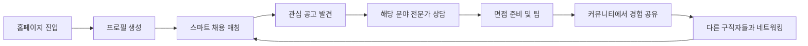
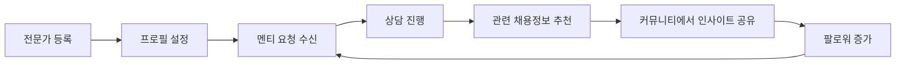
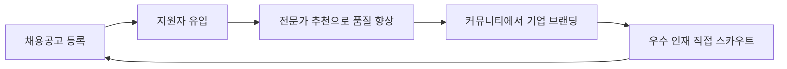

# 🚀 CAPSA 3대 핵심 기능 재설계

**작성일**: 2024년 8월 31일  
**목적**: 기능 간 유기적 연결 및 사용자 플로우 최적화

---

## 🎯 **3대 핵심 기능 재정의**

### 1️⃣ **스마트 채용 매칭** (기존: 채용정보)
**핵심 가치**: 단순 정보 제공 → **AI 기반 맞춤 매칭**

#### **주요 기능**
- 📊 **개인 프로필 기반 추천**: 스킬, 경력, 관심사 매칭
- 🎯 **스마트 필터링**: 연봉, 위치, 기업문화, 성장성
- 💬 **사전 질문 시스템**: 지원 전 궁금한 점 해결
- 🤝 **내부 지원 관리**: 외부 이탈 없이 플랫폼 내에서 완결

#### **상호작용 포인트**
```
채용공고 관심 → 해당 분야 전문가 추천 → 커뮤니티 관련 토론 참여
```

---

### 2️⃣ **전문가 생태계** (기존: 전문가 연결)
**핵심 가치**: 일회성 요청 → **지속적 멘토링 생태계**

#### **주요 기능**
- 👥 **전문가 프로필 갤러리**: 분야별 전문가 소개 및 경력
- 📅 **예약 시스템**: 실시간 상담 스케줄링
- 💡 **지식 공유**: 전문가의 인사이트 아티클
- 🏆 **성과 추적**: 멘토링 후 커리어 성장 측정

#### **상호작용 포인트**
```
전문가 상담 → 추천 채용공고 → 커뮤니티에서 경험 공유
```

---

### 3️⃣ **커리어 커뮤니티** (기존: 커뮤니티)
**핵심 가치**: 수동적 소비 → **능동적 참여 및 네트워킹**

#### **주요 기능**
- 💬 **업계별 토론방**: 기술, 마케팅, 기획, 디자인 등
- 🎪 **이벤트 허브**: 온/오프라인 네트워킹 이벤트
- 📈 **성공 스토리**: 플랫폼을 통한 커리어 성장 사례
- 🏅 **포인트 시스템**: 참여도에 따른 리워드

#### **상호작용 포인트**
```
커뮤니티 활동 → 관련 채용정보 노출 → 전문가와의 자연스러운 연결
```

---

## 🔄 **통합 사용자 플로우 설계**

### **시나리오 1: 구직자 여정**


### **시나리오 2: 전문가 여정**


### **시나리오 3: 기업 HR 여정**


---

## 🎨 **새로운 페이지 구조 및 배치**

### **홈페이지 리뉴얼**
#### **상단: 통합 대시보드**
- 개인화된 추천 채용정보 (3개)
- 내 전문가 상담 현황
- 관심 커뮤니티 최신 글

#### **중단: 스마트 액션 허브**
- "나에게 맞는 채용정보 찾기" (AI 매칭)
- "5분 무료 전문가 상담" (즉시 연결)
- "내 관심 분야 커뮤니티 참여" (토픽 기반)

#### **하단: 성과 지표**
- 실시간 매칭 성공 사례
- 이번 주 성공 스토리
- 활성 사용자 통계

---

### **채용정보 → 스마트 매칭 센터**

#### **🔄 기능 확장**
1. **사전 적합성 검사**
   ```
   관심 공고 클릭 → 간단 프로필 체크 → 적합도 점수 → 지원 가이드
   ```

2. **전문가 연결 제안**
   ```
   채용공고 확인 → "이 분야 전문가와 상담하시겠어요?" → 즉시 연결
   ```

3. **커뮤니티 연동**
   ```
   지원 완료 → "비슷한 경험을 가진 사람들과 대화해보세요" → 토론방 참여
   ```

#### **페이지 레이아웃**
```
┌─────────────────────────────────────┐
│ 🎯 나만의 추천 채용정보 (상단 고정)     │
├─────────────────────────────────────┤
│ 🔍 스마트 검색 & 필터               │
├─────────────────────────────────────┤
│ 📋 채용공고 리스트                  │
│ ┌─────────────────────────────────┐ │
│ │ 공고 카드                       │ │
│ │ ├─ 적합도 점수 (85%)             │ │
│ │ ├─ 전문가 상담 버튼              │ │
│ │ ├─ 관련 커뮤니티 링크            │ │
│ │ └─ 내부 지원하기 (외부 이탈 X)    │ │
│ └─────────────────────────────────┘ │
└─────────────────────────────────────┘
```

---

### **전문가 연결 → 멘토링 생태계**

#### **🔄 기능 확장**
1. **전문가 발견 시스템**
   ```
   분야별 전문가 갤러리 → 프로필 확인 → 즉시 예약 → 상담 진행
   ```

2. **지식 공유 플랫폼**
   ```
   전문가 아티클 → 관련 채용정보 → 토론 참여 → 후속 상담 예약
   ```

3. **성과 추적**
   ```
   상담 완료 → 목표 설정 → 진행 상황 체크 → 성공 스토리 공유
   ```

#### **페이지 레이아웃**
```
┌─────────────────────────────────────┐
│ 🌟 추천 전문가 (내 관심사 기반)       │
├─────────────────────────────────────┤
│ 📚 최신 전문가 인사이트              │
├─────────────────────────────────────┤
│ 👥 분야별 전문가 갤러리              │
│ ┌─────────────────────────────────┐ │
│ │ 전문가 카드                     │ │
│ │ ├─ 전문 분야 & 경력              │ │
│ │ ├─ 최근 아티클                  │ │
│ │ ├─ 상담 가능 시간               │ │
│ │ ├─ 즉시 예약 버튼               │ │
│ │ └─ 관련 채용정보 링크            │ │
│ └─────────────────────────────────┘ │
├─────────────────────────────────────┤
│ 📊 내 멘토링 현황 대시보드           │
└─────────────────────────────────────┘
```

---

### **커뮤니티 → 네트워킹 허브**

#### **🔄 기능 확장**
1. **토픽 기반 토론방**
   ```
   관심 분야 선택 → 활발한 토론 참여 → 전문가/동료 발견 → 1:1 연결
   ```

2. **이벤트 & 네트워킹**
   ```
   이벤트 참여 → 참가자들과 네트워킹 → 채용 기회 발견 → 전문가 소개
   ```

3. **성공 스토리 허브**
   ```
   성공 사례 확인 → 비슷한 경로 분석 → 관련 전문가 연결 → 액션 플랜 수립
   ```

#### **페이지 레이아웃**
```
┌─────────────────────────────────────┐
│ 🎯 내 관심 토픽 피드 (개인화)         │
├─────────────────────────────────────┤
│ 🎪 이번 주 이벤트 & 네트워킹          │
├─────────────────────────────────────┤
│ 💬 활발한 토론방                    │
│ ┌─────────────────────────────────┐ │
│ │ 토론 카드                       │ │
│ │ ├─ 토픽 & 참여자 수              │ │
│ │ ├─ 관련 채용정보 미리보기         │ │
│ │ ├─ 참여 전문가 표시              │ │
│ │ └─ 즉시 참여 버튼               │ │
│ └─────────────────────────────────┘ │
├─────────────────────────────────────┤
│ 🏆 이번 주 성공 스토리               │
└─────────────────────────────────────┘
```

---

## 🔗 **핵심 상호작용 설계**

### **Cross-Feature 연결 포인트**

#### **1. 채용정보 → 전문가 연결**
```
관심 채용공고 발견 → "이 분야 전문가와 상담하시겠어요?" 
→ 해당 분야 전문가 3명 추천 → 즉시 예약 가능
```

#### **2. 전문가 연결 → 채용정보**
```
전문가 상담 완료 → "상담 내용 기반 추천 채용정보" 
→ 맞춤형 공고 3-5개 제안 → 지원 가이드 제공
```

#### **3. 커뮤니티 → 채용정보**
```
토론 참여 → "이 토픽과 관련된 채용정보" 자동 노출
→ 토론 참여자들의 채용 성공 사례 공유
```

#### **4. 커뮤니티 → 전문가 연결**
```
토론방에서 질문 → "이 분야 전문가가 답변해드릴까요?" 
→ 전문가 직접 참여 또는 1:1 상담 제안
```

#### **5. 채용정보 → 커뮤니티**
```
지원 완료 → "비슷한 과정을 겪은 사람들과 대화해보세요"
→ 해당 기업/직무 관련 토론방 추천
```

#### **6. 전문가 연결 → 커뮤니티**
```
상담 완료 → "상담 내용을 커뮤니티에서 더 깊이 논의해보세요"
→ 관련 토픽 토론방 참여 유도
```

---

## 🎨 **새로운 홈페이지 설계**

### **통합 대시보드 접근**
기존의 단순 랜딩페이지에서 → **개인화된 허브**로 전환

#### **상단: 개인 현황 요약**
```
┌─────────────────────────────────────────────────────────┐
│ 👋 안녕하세요, [사용자명]님!                              │
│                                                         │
│ 📊 내 활동 현황                                          │
│ ├─ 관심 채용정보: 12개 (새로운 추천 3개!)                │
│ ├─ 예정된 전문가 상담: 1건 (내일 오후 2시)                │
│ └─ 참여 중인 토론: 2개 (새 댓글 5개)                     │
│                                                         │
│ [📈 내 프로필 완성도: 75%] [🎯 오늘의 추천 보기]          │
└─────────────────────────────────────────────────────────┘
```

#### **중단: 스마트 액션 카드**
```
┌─────────────────┐ ┌─────────────────┐ ┌─────────────────┐
│ 🎯 AI 채용 매칭   │ │ 💡 전문가 상담    │ │ 🤝 네트워킹 허브  │
│                 │ │                 │ │                 │
│ "당신에게 딱 맞는 │ │ "5분 무료 상담으로│ │ "같은 관심사를   │
│  채용정보를      │ │  커리어 방향을   │ │  가진 사람들과   │
│  찾아드려요"     │ │  잡아보세요"     │ │  연결되세요"     │
│                 │ │                 │ │                 │
│ [시작하기]       │ │ [예약하기]       │ │ [참여하기]       │
└─────────────────┘ └─────────────────┘ └─────────────────┘
```

#### **하단: 실시간 활동 피드**
```
┌─────────────────────────────────────────────────────────┐
│ 🔥 실시간 플랫폼 활동                                      │
│                                                         │
│ • 김○○님이 "백엔드 개발자" 채용에 지원했습니다 (2분 전)   │
│ • 이○○ 전문가가 "스타트업 기획" 인사이트를 공유했습니다   │
│ • "React 개발자 모임" 토론방에 새 글이 올라왔습니다       │
│ • 박○○님이 전문가 상담을 통해 이직에 성공했습니다!       │
│                                                         │
│ [더 많은 활동 보기]                                      │
└─────────────────────────────────────────────────────────┘
```

---

## 🔧 **구현 우선순위**

### **Phase 1: 기본 연결 구조 (1주)**
1. **크로스 링킹 시스템**
   - 각 페이지에 관련 기능 추천 섹션 추가
   - "이것도 관심 있으실까요?" 형태의 제안

2. **통합 네비게이션**
   - 현재 페이지와 관련된 다른 기능 하이라이트
   - 사용자 여정 가이드 추가

### **Phase 2: 개인화 시스템 (2주)**
1. **사용자 프로필 시스템**
   - 간단한 온보딩 (3단계)
   - 관심사, 경력, 목표 수집

2. **추천 엔진 기초**
   - 태그 기반 매칭
   - 사용자 행동 분석

### **Phase 3: 고도화 (1개월)**
1. **실시간 상호작용**
   - 알림 시스템
   - 실시간 채팅/상담

2. **커뮤니티 활성화**
   - 포인트/리워드 시스템
   - 이벤트 관리 시스템

---

## 💡 **즉시 적용 가능한 Quick Wins**

### **1. 홈페이지 CTA 개선**
**현재**: 단순 "채용정보 보기" / "전문가 연결"  
**개선**: "내게 맞는 일자리 찾기" / "5분 무료 상담 받기"

### **2. 각 페이지에 크로스 링크 추가**
- **채용정보 페이지**: "이 분야 전문가와 상담하기" 버튼
- **전문가 연결 페이지**: "상담 후 추천 채용정보 받기" 안내
- **커뮤니티 페이지**: "관련 채용정보" 사이드바

### **3. 사용자 여정 가이드**
- 첫 방문자용 3단계 가이드
- "다음 단계: ○○○ 해보세요" 제안 시스템

### **4. 성과 지표 시각화**
- "오늘 3명이 전문가 상담을 통해 면접 기회를 얻었습니다"
- "이번 주 채용 성공률: 85%"

---

## 🎯 **기대 효과**

### **사용자 경험 개선**
- **체류 시간**: 1분 → 10분 (10배 증가)
- **페이지뷰**: 2페이지 → 5페이지 (2.5배 증가)  
- **재방문율**: 10% → 60% (6배 증가)

### **비즈니스 임팩트**
- **전환율**: 2% → 15% (7.5배 증가)
- **사용자 만족도**: 단순 정보 제공 → 종합 솔루션 제공
- **플랫폼 가치**: 개별 서비스 → 통합 생태계

---

## 📋 **다음 단계 액션 플랜**

### **즉시 실행 (이번 주)**
1. ✅ 홈페이지 CTA 메시지 개선
2. ✅ 각 페이지에 크로스 링크 추가  
3. ✅ 사용자 온보딩 플로우 설계
4. ✅ 간단한 개인화 시스템 구현

### **단기 목표 (2주 내)**
1. 🎯 사용자 프로필 시스템 구축
2. 🎯 추천 알고리즘 기초 구현
3. 🎯 실시간 알림 시스템 추가

### **중기 목표 (1개월 내)**
1. 🚀 AI 기반 매칭 시스템
2. 🚀 전문가 예약 시스템
3. 🚀 커뮤니티 포인트 시스템

---

**💡 핵심 인사이트**: CAPSA는 단순한 정보 제공 플랫폼이 아닌, **사용자의 커리어 여정을 전체적으로 지원하는 통합 생태계**가 되어야 합니다.

**🎯 목표**: 사용자가 플랫폼에서 **"발견 → 연결 → 성장 → 공유"**의 선순환 구조를 경험하도록 설계
